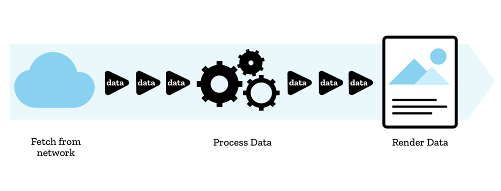

# The Edge Alternative

**The Problem** is "converting a *remote* CSV/DSV to JSON, addressing scalability issues and potentially huge contents".

**Server side**, scalable conversion usually relies on Node.js streams. Check [CSV-Parse](https://csv.js.org/parse/api/stream/) to see a practical example. **However**, in a previous step, you'd need to download (therefore copy) the source.

**Browser side**, most libraries expect a string input. Instead, [Papa Parse](https://www.papaparse.com/docs#remote-files)'s can also take the source's URL. It will retrieve its contents in chunks of, at most, 5MB, through XMLHttpRequest, and scales by offloading to a webworker. **However** this needs the source to support CORS and ideally Range requests.

[Web Streams](https://developer.mozilla.org/en-US/docs/Web/API/Streams_API) support sequential access to remote sources by design. They can pipe to each other, allowing for a workflow in which fetching the source, transforming the contents and streaming the result to the visitor can be performed in a single step, without holding the source contents, at all. 

While not exclusive to [Cloudflare Workers](https://developers.cloudflare.com/workers/) environment, running the streams at the edge doesn't need CORS, doesn't depend on user's network latency, and it allows for the response to be consumed from anywhere that would take an URL: command line, browser side, server side, desktop apps, and more. 

Additionally, workers are able to stream responses in real time (see [TransformStream](https://developers.cloudflare.com/workers/learning/using-streams) example), whereas other serverless providers will buffer by design (according to [Vercel Docs:Streaming Responses](https://vercel.com/docs/concepts/limits/overview#streaming-responses)). 

This library cannot claim for itself the title of the fastest parser, for it isn't CSV parser. Instead, it enables usage of Web Streams to feed source's contents sequentially to either [PapaParse](https://www.papaparse.com/docs#remote-files) or [CSV Parse](https://csv.js.org/parse/distributions/browser_esm/) core parsing engines. It claims, however, the title of fastest [Time to First Byte](https://developer.mozilla.org/en-US/docs/Glossary/time_to_first_byte) keeping competitive total overall time versus traditional conversion workflows. 

